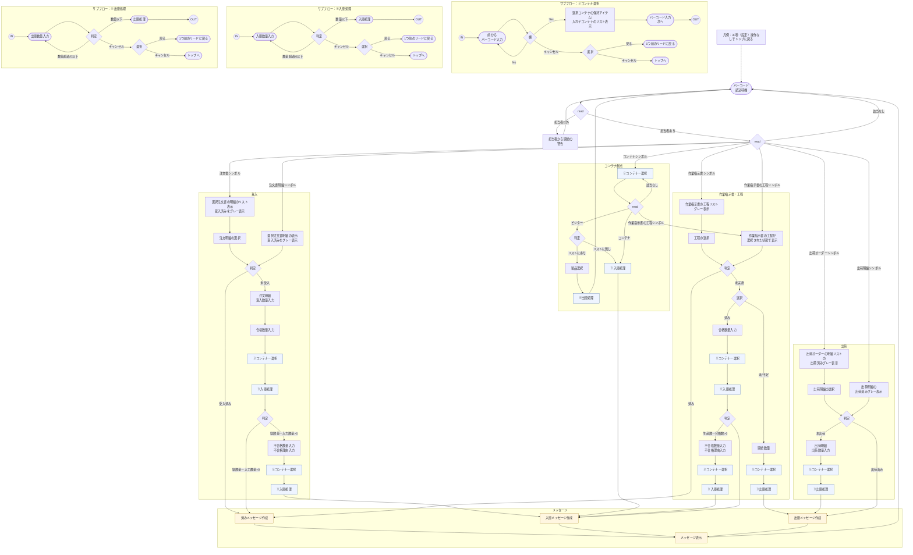

```mermaid
%% ハンディ端末 業務フロー（handy_flow.drawio.svg 最新版を変換）
%% 形状: ([ ])=開始/端点(角丸)  [ ]=処理  { }=分岐(read/判定/選択)
%% 「※」付きの処理は下部のサブフロー（※コンテナ選択／※入庫処理／※出庫処理）を呼び出す
flowchart TD

  %% ===== 起点・担当者 =====
  WAIT(["バーコード<br/>読込待機"])
  R0{"read"}
  WARN["担当者から開始の<br/>警告"]
  R1{"read"}

  WAIT --> R0
  R0 -- 担当者以外 --> WARN --> WAIT
  R0 -- 担当者あり --> R1
  R1 -- 該当なし --> WAIT

  %% ===== 受入（注文書） =====
  subgraph RCV["受入"]
    PO_LIST["選択注文書の明細のリスト表示<br/>受入済みをグレー表示"]
    PO_SEL["注文明細の選択"]
    POL_DISP["選択注文書明細の表示<br/>受入済みをグレー表示"]
    J_RCV{"判定"}
    RCV_QTY["注文明細<br/>受入数量入力"]
    RCV_OK["合格数量入力"]
    RCV_C1["※コンテナー選択"]
    RCV_IN1["※入庫処理"]
    J_RCV2{"判定"}
    RCV_NG["不合格数量入力<br/>不合格理由入力"]
    RCV_C2["※コンテナー選択"]
    RCV_IN2["※入庫処理"]
  end

  R1 -- 注文書シンボル --> PO_LIST --> PO_SEL --> J_RCV
  R1 -- 注文書明細シンボル --> POL_DISP --> J_RCV
  J_RCV -- 未受入 --> RCV_QTY --> RCV_OK --> RCV_C1 --> RCV_IN1 --> J_RCV2
  J_RCV2 -- "総数量ー入力数量>0" --> RCV_NG --> RCV_C2 --> RCV_IN2

  %% ===== コンテナ起点 =====
  subgraph CNT["コンテナ起点"]
    CNT_C["※コンテナー選択"]
    R2{"read"}
    J_LIST{"判定"}
    PROD_SEL["製品選択"]
    CNT_OUT["※出庫処理"]
    CNT_IN["※入庫処理"]
  end

  R1 -- コンテナシンボル --> CNT_C --> R2
  R2 -- 該当なし --> CNT_C
  R2 -- ビジター --> J_LIST
  J_LIST -- リストにあり --> PROD_SEL --> CNT_OUT
  J_LIST -- リストに無し --> CNT_IN
  R2 -- コンテナ --> CNT_IN

  %% ===== 作業指示書（工程） =====
  subgraph WO["作業指示書・工程"]
    WO_LIST["作業指示書の工程リスト<br/>グレー表示"]
    WO_SEL["工程の選択"]
    OP_DISP["作業指示書の工程が<br/>選択された状態で表示"]
    J_OP{"判定"}
    S_OP{"選択"}
    START_QTY["開始数量"]
    OP_C0["※コンテナー選択"]
    OP_OUT["※出庫処理"]
    OP_OK["合格数量入力"]
    OP_C1["※コンテナー選択"]
    OP_IN1["※入庫処理"]
    J_OP2{"判定"}
    OP_NG["不合格数量入力<br/>不合格理由入力"]
    OP_C2["※コンテナー選択"]
    OP_IN2["※入庫処理"]
  end

  R1 -- 作業指示書シンボル --> WO_LIST --> WO_SEL --> J_OP
  R1 -- 作業指示書の工程シンボル --> OP_DISP
  R2 -- 作業指示書の工程シンボル --> OP_DISP
  OP_DISP --> J_OP
  J_OP -- 未実施 --> S_OP
  S_OP -- "未/不足" --> START_QTY --> OP_C0 --> OP_OUT
  S_OP -- 済み --> OP_OK --> OP_C1 --> OP_IN1 --> J_OP2
  J_OP2 -- "生産数ー合格数>0" --> OP_NG --> OP_C2 --> OP_IN2

  %% ===== 出荷 =====
  subgraph SHP["出荷"]
    SO_LIST["出荷オーダーの明細リストの<br/>出荷済みグレー表示"]
    SO_SEL["出荷明細の選択"]
    SOL_DISP["出荷明細の<br/>出荷済みグレー表示"]
    J_SHP{"判定"}
    SHP_QTY["出荷明細<br/>出荷数量入力"]
    SHP_C["※コンテナー選択"]
    SHP_OUT["※出庫処理"]
  end

  R1 -- 出荷オーダーシンボル --> SO_LIST --> SO_SEL --> J_SHP
  R1 -- 出荷明細シンボル --> SOL_DISP --> J_SHP
  J_SHP -- 未出荷 --> SHP_QTY --> SHP_C --> SHP_OUT

  %% ===== メッセージ =====
  subgraph MSG["メッセージ"]
    M_DONE["済みメッセージ作成"]
    M_IN["入庫メッセージ作成"]
    M_OUT["出庫メッセージ作成"]
    M_SHOW["メッセージ表示"]
  end

  J_RCV -- 受入済み --> M_DONE
  J_RCV2 -- "総数量ー入力数量=0" --> M_DONE
  J_OP -- 済み --> M_DONE
  RCV_IN2 --> M_IN
  CNT_IN --> M_IN
  OP_IN2 --> M_IN
  J_OP2 --> M_IN
  CNT_OUT --> WAIT
  OP_OUT --> M_OUT
  SHP_OUT --> M_OUT
  J_SHP -- 出荷済み --> M_OUT
  M_DONE --> M_SHOW
  M_IN --> M_SHOW
  M_OUT --> M_SHOW
  M_SHOW --> WAIT

  %% ===== サブフロー定義 =====
  subgraph SUB_C["サブフロー：※コンテナ選択"]
    C_IN(( IN ))
    C_SCAN(["前から<br/>バーコード入力"])
    C_SHELF{"棚"}
    C_LIST["選択コンテナの保持アイテム/<br/>入れ子コンテナのリスト表示"]
    C_NEXT(["バーコード入力<br/>次へ"])
    C_OUT(( OUT ))
    C_SEL{"選択"}
    C_BACK(["1つ前のリードに戻る"])
    C_TOP(["トップへ"])
    C_IN --> C_SCAN --> C_SHELF
    C_SHELF -- Yes --> C_LIST --> C_NEXT --> C_OUT
    C_SHELF -- No --> C_SCAN
    C_SHELF -- キャンセル --> C_SEL
    C_SEL -- 戻る --> C_BACK
    C_SEL -- キャンセル --> C_TOP
  end

  subgraph SUB_I["サブフロー：※入庫処理"]
    I_IN(( IN ))
    I_QTY(["入庫数量入力"])
    I_J{"判定"}
    I_EXEC(["入庫処理"])
    I_OUT(( OUT ))
    I_SEL{"選択"}
    I_BACK(["1つ前のリードに戻る"])
    I_TOP(["トップへ"])
    I_IN --> I_QTY --> I_J
    I_J -- "数量超過/0以下" --> I_QTY
    I_J -- 数量以下 --> I_EXEC --> I_OUT
    I_J -- キャンセル --> I_SEL
    I_SEL -- 戻る --> I_BACK
    I_SEL -- キャンセル --> I_TOP
  end

  subgraph SUB_O["サブフロー：※出庫処理"]
    O_IN(( IN ))
    O_QTY(["出庫数量入力"])
    O_J{"判定"}
    O_EXEC(["出庫処理"])
    O_OUT(( OUT ))
    O_SEL{"選択"}
    O_BACK(["1つ前のリードに戻る"])
    O_TOP(["トップへ"])
    O_IN --> O_QTY --> O_J
    O_J -- "数量超過/0以下" --> O_QTY
    O_J -- 数量以下 --> O_EXEC --> O_OUT
    O_J -- キャンセル --> O_SEL
    O_SEL -- 戻る --> O_BACK
    O_SEL -- キャンセル --> O_TOP
  end

  NOTE["凡例：30秒（設定）操作なしでトップに戻る"]
  NOTE -.-> WAIT

  %% サブフロー呼び出し箇所を色分け
  classDef subcall fill:#eef4ff,stroke:#4a6fa5
  classDef msg fill:#fff6e0,stroke:#b08a2e
  class RCV_C1,RCV_IN1,RCV_C2,RCV_IN2,CNT_C,CNT_OUT,CNT_IN,OP_C0,OP_OUT,OP_C1,OP_IN1,OP_C2,OP_IN2,SHP_C,SHP_OUT subcall
  class M_DONE,M_IN,M_OUT,M_SHOW msg
```